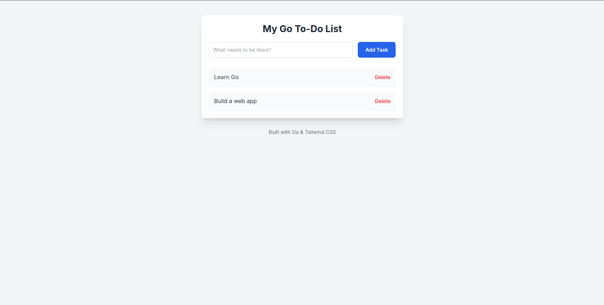

# Go To-Do Web Application

This is a simple To-Do list web application written in Go. It uses the `net/http` package to serve HTTP requests.

The application allows users to:

* View a list of to-do items.
    
* Add new items to the list.
    
* Delete items from the list.
    

All data is stored in memory and will be reset when the application restarts.

---


## Running the server

To run the server, navigate to the root of the project directory and execute the following command:

Bash

```bash
go run main.go
```

The server will start on port **8080**. You can access the application by navigating to [`http://localhost:8080`](http://localhost:8080) in your web browser.

---
## Looks like this

